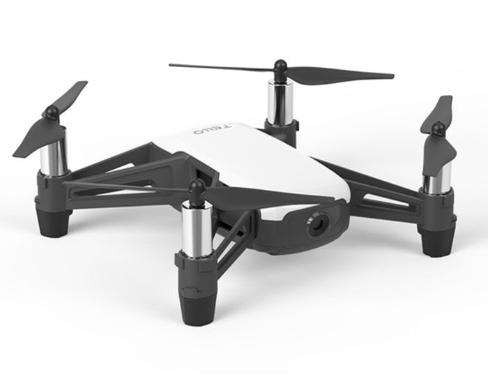

# tello-control a python package to control your Tello drone

This is a package to control your Tello Drone. A significant part of the code is from the TelloPy package 
from Hanyazou and the original GOBOT project (https://gobot.io/blog/2018/04/20/hello-tello-hacking-drones-with-go)



Compared with the existing package, this has
+ a documentation
+ allows logging data in background
+ allows recording video files (mkv) in background
+ allows reading all the drone sensors using the so-called "low level protocol"

## Installation
To Do : publish the package
You can clone the github repo and use the code or you can install the package using pip.

```
$ pip install tello-control
```

## Documentation
To Do : publish the doc
The package is well documented. You can find the doc in the docs\build\html folder.

## Examples
The documentation includes various examples in the "Getting started" examples.
